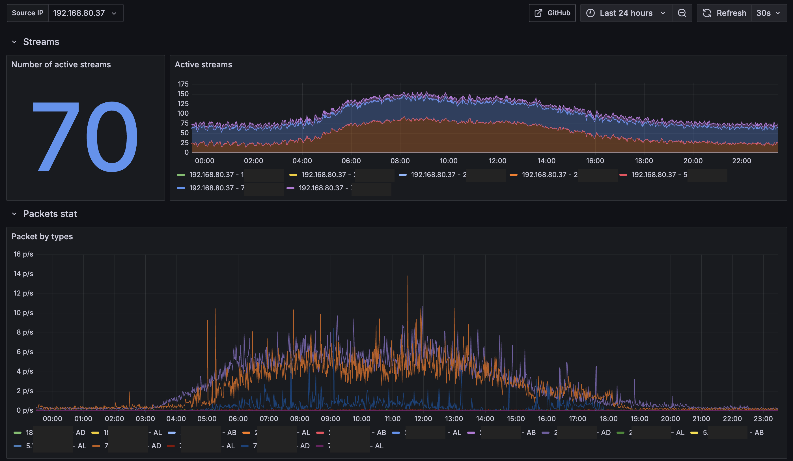

# wialon_ips_exporter


Wialon IPS 1.0 protocol [PCAP based](https://github.com/gopacket/gopacket) Prometheus metrics exporter.

Service traces raw packets using pcap library, parses packets, and then serves metrics:

```text
# HELP wialon_ips_packets_total Total number of IPS packets
# TYPE wialon_ips_packets_total counter
wialon_ips_packets_total{dst_ip="188.123.45.67",src_ip="192.168.1.1",type="AD"} 72
wialon_ips_packets_total{dst_ip="192.168.1.1",src_ip="188.123.45.67",type="D"} 72
wialon_ips_packets_total{dst_ip="192.168.1.1",src_ip="212.45.6.123",type="B"} 7
wialon_ips_packets_total{dst_ip="192.168.1.1",src_ip="212.45.6.123",type="L"} 4

# HELP wialon_ips_raw_packets_total Total number of packets handled
# TYPE wialon_ips_raw_packets_total counter
wialon_ips_raw_packets_total 6125

# HELP wialon_ips_streams_size Number of currently active streams
# TYPE wialon_ips_streams_size gauge
wialon_ips_streams_size 298
```

## Screenshots

Grafana dashboard based on the metrics:




## Install

Build locally on the target host:

```bash
apt-get update
apt-get install libpcap0.8 libc6 libpcap-dev gcc

git clone git@github.com:artembaikuzin/wialon_ips_exporter.git

cd wialon_ips_exporter

make build
```

Setup and run:

```bash
mv wialon_ips_exporter /usr/local/bin/wialon_ips_exporter

cp init/wialon_ips_exporter.service /etc/systemd/system/
systemctl daemon-reload
systemctl enable wialon_ips_exporter.service

systemctl start wialon_ips_exporter.service
```

### Prometheus

Define prometheus scrape config:

```yml
scrape_configs:
  - job_name: wialon-ips
    static_configs:
      - targets: ['wialon-production-host:9332']
        labels:
          instance: 'production'
```

Reload configuration:

```bash
prometheus kill -HUP 1
```

### Grafana

1. Configure prometheus datasource
2. Import [grafana/Wialon IPS Exporter.json](grafana/Wialon%20IPS%20Exporter.json) dashboard
